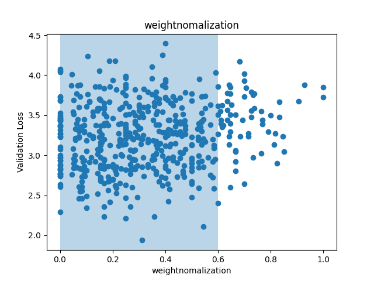
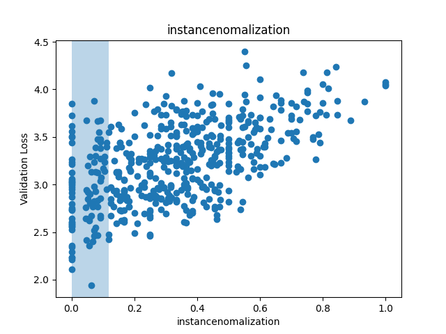
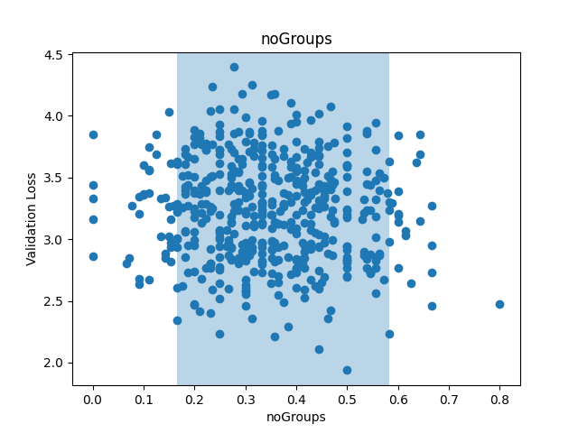
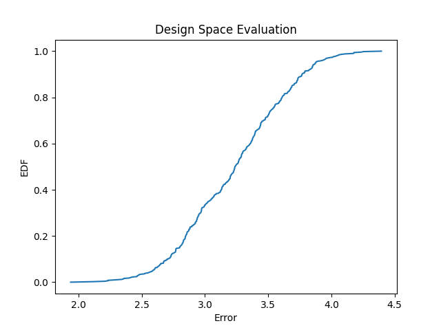

# DanyNet-Design-Space

Based on this Pape:r https://arxiv.org/abs/2003.13678 I designed my own Design Space
The first test is about Normalization Technique and Art of Convolutions. You can find it under Version 0 

## Version 0

The 3 Normalization Taktiks are: 
Batch Normalization 

Weight Normalization 

Instance Normalization   

There you can see that Batch Normalization is still the best Technique and that weight normalization seems to be better for this Example then Instance Normalization

The three arts of ConvBlocks are: 
ResnetBlock with 2 Convolutions without Groups (1) 

ResnetBlock with 2 Convolutions first being a depthwise Convolution and second no Groups(2) 

ResnetBlock with 2 Convolutions first no Groups second being the depthwise Convolution.(3) 

It Seems that around a 30% (2) and 70% (1) is the best option. But this doesn't seem to matter that much. The only thing that is slighly worese is the usage of (3). 
The Design space rating via EDF looks like this: 

